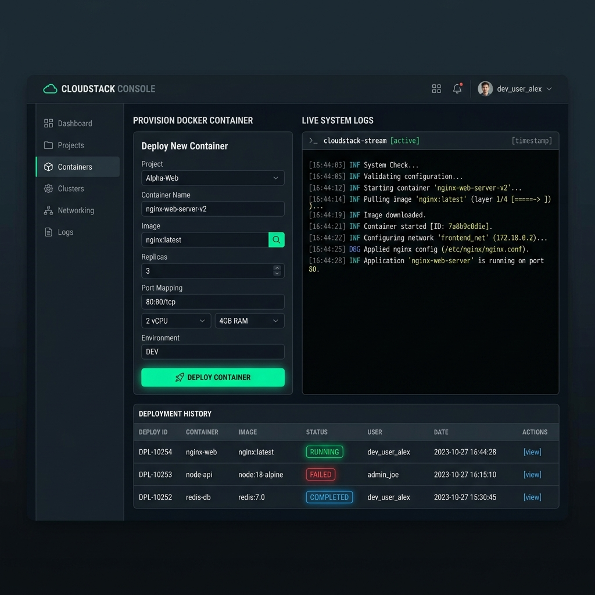

# CloudDeploy Hosting Control Panel

A simulated full-stack hosting platform onboarding system that demonstrates asynchronous job queuing and container orchestration. Admin users can submit Docker-based deployments which are processed asynchronously through a background worker via Redis/BullMQ.

---

## 📸 Dashboard Preview



---

## 🏗️ Architecture & Flow

This application is built with a modern decoupled modular microservices architecture:

```
[ React.js Frontend ] 
       │ (HTTP POST / GET)
       ▼
[ Express.js Backend ] ──(Saves Deployment: Pending)──► [ MongoDB ]
       │
       ├─(Pushes job)─► [ BullMQ (Redis) Queue ]
                               │
                               ▼
                        [ Node.js Worker ] 
                               │
                               ├─► Runs: docker run (or simulated CLI)
                               ├─► Runs: AWS Lambda trigger (or simulated SDK v3)
                               ▼
                        [ DB Log Append ] ──► (Updates Status: Deploying -> Completed / Failed)
```

1. **Submit Request**: The React dashboard sends client settings to the backend REST API.
2. **Database Persistence**: The API creates a database record with a `Pending` status and empty log lists.
3. **Queue Push**: The job is forwarded to Redis via a BullMQ client.
4. **Worker Pickup**: The worker picks up the job, updating the database status to `Deploying` and piping output logs.
5. **Infrastructure Operations**:
   * **Docker Execution**: The worker executes a Docker container launch (falling back to CLI simulation).
   * **Cloud Trigger**: The worker notifies AWS Lambda using AWS SDK v3 to configure routing (simulated fallback).
6. **Completion**: Status transitions to `Completed` (or `Failed`), and the frontend polling displays success/failure states.

---

## 🛠️ Tech Stack

* **Frontend**: React.js (Vite), Axios, Tailwind CSS v3
* **Backend**: Node.js, Express.js, Mongoose (MongoDB ODM)
* **Job Queue**: Redis, BullMQ
* **Orchestration**: Docker Command Line interface (child_process execution)
* **Cloud Integration**: AWS SDK v3 `@aws-sdk/client-lambda`

---

## 📁 Folder Structure

```
hosting-control-panel/
├── backend/
│   ├── config/
│   │   └── queue.js             # Redis Connection and Queue creation
│   ├── models/
│   │   └── Deployment.js        # Mongoose database model
│   ├── routes/
│   │   └── deploy.js            # Express API Endpoints
│   ├── server.js                # Express app server entry point
│   └── package.json
├── worker/
│   ├── models/
│   │   └── Deployment.js        # Schema copy for standalone worker
│   ├── services/
│   │   ├── dockerService.js     # CLI docker orchestrator / simulator
│   │   └── awsService.js        # AWS SDK Lambda client / simulator
│   ├── worker.js                # BullMQ listener processor
│   └── package.json
├── frontend/
│   ├── src/
│   │   ├── components/
│   │   │   ├── DeploymentForm.jsx
│   │   │   ├── StatusCard.jsx
│   │   │   ├── HistoryTable.jsx
│   │   │   └── Toast.jsx
│   │   ├── App.jsx
│   │   ├── index.css
│   │   └── main.jsx
│   ├── package.json
│   ├── tailwind.config.js
│   └── vite.config.js
├── screenshots/
│   └── dashboard_mockup.png
├── .env.example
└── README.md
```

---

## 🚀 Installation & Local Setup

Ensure you have **Node.js** (v18+) and **npm** installed on your system.

### Prerequisites (Database & Redis Queue)

#### Option A: Run via Docker (Easiest)
If you have Docker installed, you can spin up MongoDB and Redis in one command:
```bash
docker run -d -p 27017:27017 --name hcp-mongo mongo:latest
docker run -d -p 6379:6379 --name hcp-redis redis:latest
```

#### Option B: Local Installations
Alternatively, ensure the native services are running:
* **MongoDB**: Standard connection on `mongodb://localhost:27017`
* **Redis**: Server active on `localhost:6379`

---

### Step 1: Environment Setup

Copy `.env.example` to the root folder (or folders) and name it `.env`:
```bash
cp .env.example .env
```
*(Or manually create `.env` in the root folder with backend, database, and Redis parameters)*

---

### Step 2: Backend Setup & Run

1. Navigate to the backend folder:
   ```bash
   cd backend
   ```
2. Install dependencies:
   ```bash
   npm install
   ```
3. Run the development server:
   ```bash
   npm run dev
   ```
   The backend will start listening on `http://localhost:5000`.

---

### Step 3: Worker Setup & Run

1. Open a new terminal tab and navigate to the worker folder:
   ```bash
   cd worker
   ```
2. Install dependencies:
   ```bash
   npm install
   ```
3. Run the worker process:
   ```bash
   npm run dev
   ```
   The worker will connect to MongoDB and start listening for BullMQ queue events.

---

### Step 4: Frontend Setup & Run

1. Open a new terminal tab and navigate to the frontend folder:
   ```bash
   cd frontend
   ```
2. Install dependencies:
   ```bash
   npm install
   ```
3. Start the Vite React development server:
   ```bash
   npm run dev
   ```
4. Click the link printed in the terminal (usually `http://localhost:5173`) to launch the control panel.

---

## 🔌 API Documentation

All routes are prefix-mapped under `/api`.

### 1. Provision Deployment
* **Endpoint**: `POST /api/deploy`
* **Content-Type**: `application/json`
* **Payload**:
  ```json
  {
    "clientName": "Acme Corp",
    "domain": "acme.app.com",
    "image": "nginx:alpine"
  }
  ```
* **Success Response (201 Created)**:
  ```json
  {
    "success": true,
    "deploymentId": "65b4c1064295ba5d1a49df55",
    "message": "Deployment job queued successfully."
  }
  ```

### 2. Poll Deployment Status & Logs
* **Endpoint**: `GET /api/status/:id`
* **Success Response (200 OK)**:
  ```json
  {
    "success": true,
    "status": "Deploying",
    "logs": [
      "[11:40:02 AM] [System] Worker picked up job. Launching hosting setup...",
      "[11:40:02 AM] [System] Executing Container Provisioning step...",
      "[11:40:02 AM] [Docker-Sim] Simulating command: docker pull nginx:alpine"
    ],
    "deployment": { ... }
  }
  ```

### 3. Fetch List History
* **Endpoint**: `GET /api/deployments`
* **Success Response (200 OK)**:
  ```json
  {
    "success": true,
    "deployments": [ ... ]
  }
  ```

### 4. Retry Failed/Completed Container Deployment
* **Endpoint**: `POST /api/deploy/retry/:id`
* **Success Response (200 OK)**:
  ```json
  {
    "success": true,
    "deploymentId": "65b4c1064295ba5d1a49df55",
    "message": "Deployment retry job queued."
  }
  ```

---

## 🔮 Future Improvements

1. **WebSocket Integration**: Upgrade status tracking from polling to socket streams (`socket.io`) for instantaneous console output feeds.
2. **Docker Logs Streaming**: Bind child-process stdout stream directly to standard out to read container stdout in real time.
3. **Advanced Security**: Implement JWT auth and RBAC (Role-Based Access Control) to prevent unauthorized containers from being spun up.
4. **AWS Infrastructure**: Deploying a live AWS Lambda and AWS ECS instance using AWS CDK pipelines.
